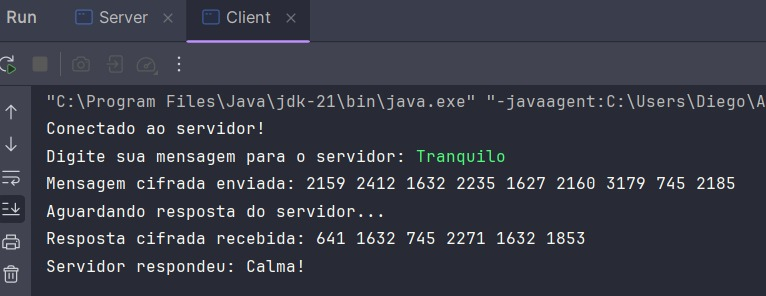
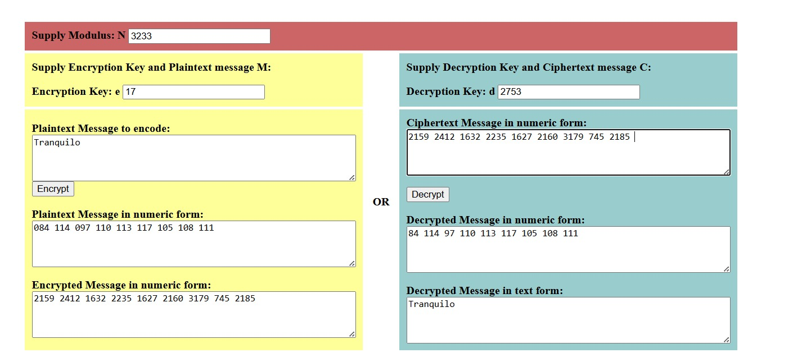
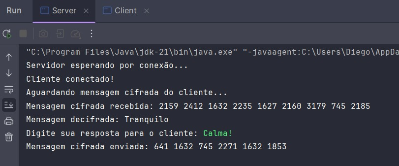
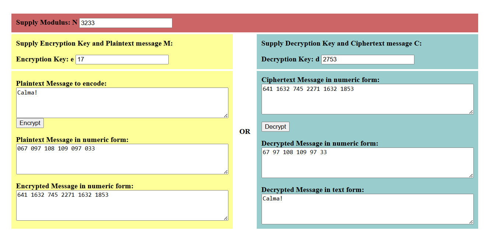

# EASY TECH

## Integrantes

- MATHEUS MATOS - RM:99792
- KAREN VITORIA JESUS DA SILVA - RM:99468
- JULIANNY ARAUJO PEREIRA - RM:99554
- DIEGO HENRIQUE SANTOS DE OLIVEIRA - RM:550269
- JULIA DE FATIMA QUEIROZ - RM:551130

# Projeto: Envio de Mensagens Cifradas com RSA (Cliente-Servidor)

Este projeto implementa um sistema de comunicação Cliente-Servidor utilizando o algoritmo RSA para criptografar e decifrar mensagens trocadas entre eles. As chaves públicas e o módulo (n) são predefinidos no servidor e no cliente, eliminando a necessidade de troca de chaves durante a comunicação.

## Funcionalidades
- **Cliente**: Envia mensagens cifradas ao servidor e recebe respostas também cifradas.
- **Servidor**: Recebe mensagens cifradas do cliente, as decifra e envia uma resposta cifrada de volta.
- **Criptografia RSA**: As mensagens são criptografadas usando o algoritmo RSA, garantindo a confidencialidade das comunicações.

## Tecnologias Utilizadas
- **Java**: Linguagem de programação utilizada para desenvolver tanto o cliente quanto o servidor.
- **Sockets TCP/IP**: Comunicação entre o cliente e o servidor é feita via sockets utilizando o protocolo TCP/IP.
- **Algoritmo RSA**: O algoritmo de criptografia RSA é utilizado para cifrar e decifrar as mensagens.

## Recursos Utilizados
- **Java**: JDK 21
- **IDE**: IntelliJ IDEA

## Como Executar o Projeto

### 1. Rodar o Servidor

- Execute a classe `Server.java`.
- O servidor estará aguardando conexões de um cliente na porta `12345`.

### 2. Rodar o Cliente

- Execute a classe `Client.java`.
- O cliente irá se conectar ao servidor na porta `12345`.
- O cliente irá enviar mensagens cifradas ao servidor e receber respostas cifradas.

## Exemplo de Execução

 

